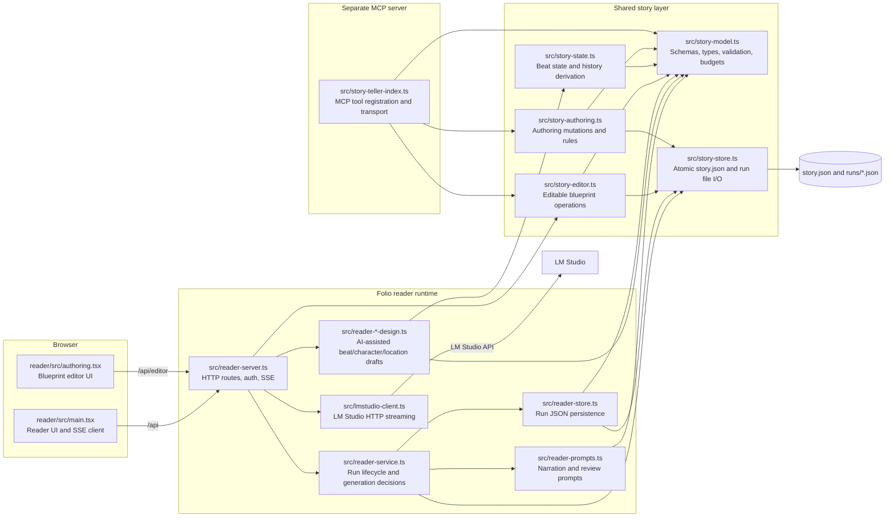

# Folio TypeScript Map

This is the short version of how the Folio reader and story authoring pieces fit together.

## Responsibility key

| File | Owns |
| --- | --- |
| `reader-server.ts` | Fastify routes, authentication, SSE lifecycle, and wiring dependencies together. |
| `reader-service.ts` | Reader run rules: prepare prompts, accept/regenerate/review beats, and update run state. |
| `reader-store.ts` | The reader run format and persistence of `runs/<uuid>.json`. |
| `reader-prompts.ts` | Context-mode-specific narration prompts and reasoning parsing. |
| `lmstudio-client.ts` | The network protocol for listing models and streaming LM Studio responses. |
| `story-model.ts` | The canonical `story-v3` schema, types, validation, and beat-budget helpers. |
| `story-store.ts` | Safe filesystem access and atomic reads/writes for `story.json` and run files. |
| `story-editor.ts` | Read/save/list operations for editable story blueprints. |
| `story-authoring.ts` | Domain operations used by authoring tools: create, add, validate, and finalize. |
| `story-state.ts` | Derived state and history calculations used when constructing reader context. |
| `story-teller-index.ts` | MCP-facing registration for authoring and telling tools; it delegates domain work. |

The `reader/` TypeScript files are the browser client. The root `src/` files are the server, domain, and persistence layers. `tools.ts`, `skills.ts`, `workflow.ts`, `sandbox.ts`, and related files are the separate general-purpose MCP servers, not part of the Folio reader request path.